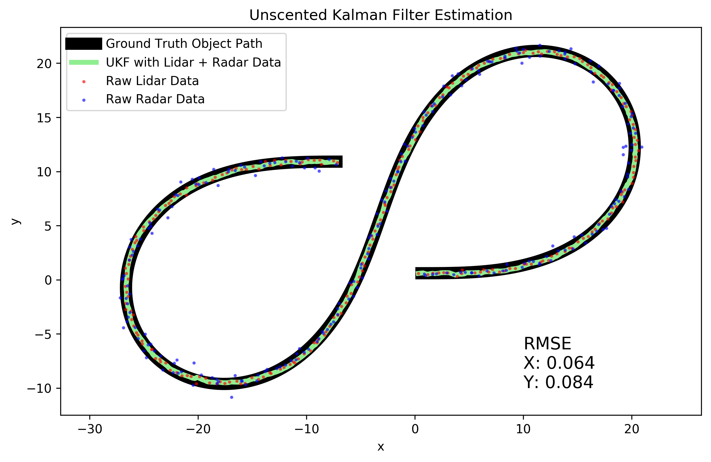
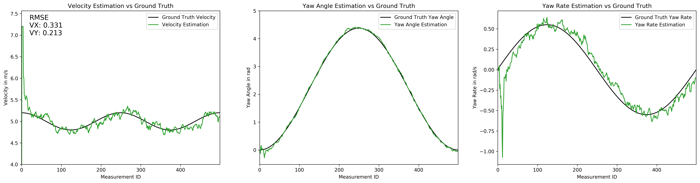
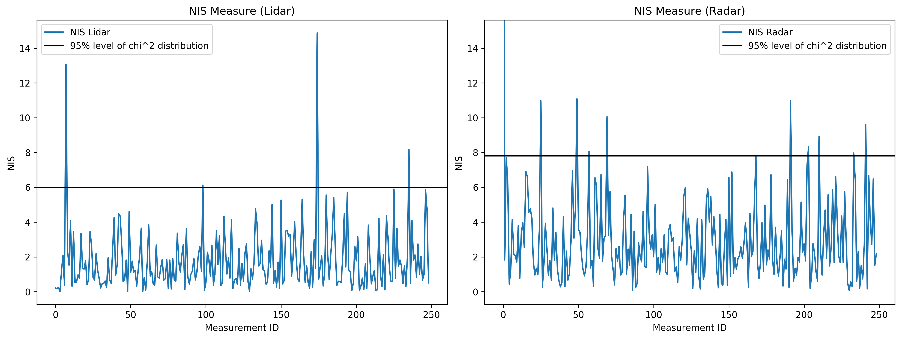

# **Unscented Kalman Filter**

Project to track an object using an Unscented Kalman Filter (UKF) and sensor data from Lidar and Radar sensors.

Build guide: [BUILD.md](BUILD.md)  
Source code: [src/](src/)  

## Position Estimation with Unscented Kalman Filter:

## Movement Estimation with Unscented Kalman Filter:

## NIS Measure of Unscented Kalman Filter:

